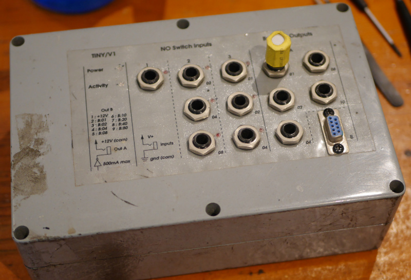
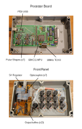

# Tiny/V1

Documentation and example python script for ancient HC11 I/O box

Tiny is a USB I/O device with a precision timebase
for reading relay switches and driving inductive
loads. Three input capture channels provide up to
7 timestamped inputs. Two output ports provide up
to 13 programmable driver outputs.

Internally, the tiny maintains a 32bit clock
running at 156250Hz +-0.5ppm (2.5MHz/16).

USB communication is through a FTDI serial converter.

## Inputs

Each of the 7 input ports is opto-coupled and conditioned
through a 10ms re-triggerable monostable into an input capture
port in the tiny. Input triggers record the 32 bit clock
value and queue an input report to be sent over USB.
Channels 2 and 3 multiplex three input ports into the same
input capture.

## Outputs

Tiny has two output ports with a total of 13 buffered ports.
Each output port is suitable for inductive loads (eg relay,
motor, light) and can source up to 500mA. 

Port A provides 5 output ports which can be scheduled to be 
set when the internal clock matches a specific 32 bit value.

Port B provides 8 programmable output ports.

If port A is manually set, any pending schedule will be
cancelled.

## Protocol

Tiny sends and receives message frames of 5 bytes:
One identifying byte, and 4 data bytes. Valid commands
received by tiny will be echoed back to the host.
Invalid commands will be ignored.

### Commands

#### Reset clock (0x00):

	0x00 0xXX 0xXX 0xXX 0xXX

Tiny will reset the internal clock to zero. The
four data bytes are ignored.

#### Set ports (0x04):

	0x04 [PB] 0xXX [PA] 0xXX

Where:

    - [PB] is the desired state of ports 1-8 on Port B
    - [PA] is 0x80 ORed with the desired state of Port A
      or 0x00 to leave Port A unchanged

#### Schedule PA (0xE0):

	[PA] [CLOCK]

Where:

   - [PA] is 0xE0 ORed with the desired state of Port A
   - [CLOCK] is the big-endian 32 bit clock time

Schedule port A to be set to the desired state when the tiny
clock is exactly the same as the specified value. Note that
due to processing delays in the tiny, CLOCK should be about
0.5 seconds ahead of the current clock or else it may be missed.

### Responses

Tiny will echo any valid command back to the host, acknowledging
the command. In addition several messages are sent un-solicited
by the tiny. In each case below, [CLOCK] is the big-endian 32
bit clock time of the event being reported.

#### Heartbeat

	0x10 [CLOCK]

Heartbeat messages are sent to the host every 2^16 clocks
(~0.4 seconds).

#### Input Channel 1

	0x20 [CLOCK]

Report an input trigger on channel 1.

#### Input Channel 2

	0x4[PORTS] [CLOCK]

Where:

   - [PORTS] is the 4 bit ORed input channel state of ports 02, 04 and 08

#### Input Channel 3

	0x8[PORTS] [CLOCK]

Where:

   - [PORTS] is the 4 bit ORed input channel state of ports 01, 02 and 04

#### Output Schedule Port A

	[PA] [CLOCK]

Where:

   - [PA] is 0xE0 ORed with the updated state of Port A

### Frame Alignment

When connecting to the tiny, buffers on the FTDI USB 
adapter must be aligned so that the 5 byte command and 
response frames are properly sent and received. The
safest approach is to repeatedly send a specially 
crafted 6 byte message to the tiny and read to a timeout.
When the command and reply buffers are aligned, the tiny
will respond with an acknowledge frame.

The command to send is:

	0x10 0xe0 0x7f 0x0f 0x55 0x2a

The only valid command byte in the frame is 0xe0 in the
second position, all other bytes will be ignored by tiny.
The alignment proceeds as follows:

	SEND: 0x10e07f0f552a
	RECV: 0x22f0000249
	RECV: 0x0ae541d8 [short read]

Assuming the write buffer was empty (worst case),
the tiny receives command 0x10e007f055 which it would ignore.
The write buffer now contains a single byte 0x2a.
There is some garbage in the read buffer, which is read out.

	SEND: 0x10e07f0f552a
	RECV: 0x1022f10002
	RECV: [timeout]

The next six bytes are added to 0x2a and the tiny sees 
command 0x2a10e07f0f, which it ignores. The write buffer
now contains 0x552a

	SEND: 0x10e07f0f552a
	RECV: 0x1022f20002
	RECV: [timeout]

The next six bytes are added to 0x552a and the tiny sees 
command 0x552a10e07f, which it ignores. The write buffer
now contains 0x0f552a

	SEND: 0x10e07f0f552a
	RECV: 0x1022f30002
	RECV: [timeout]

The next six bytes are added to 0x0f552a and the tiny sees 
command 0x0f552a10e0, which it ignores. The write buffer
now contains 0x7f0f552a

	SEND: 0x10e07f0f552a
	RECV: 0xe07f0f552a

The next six bytes are added to 0x7f0f552a and the tiny sees 
command 0x7f0f552a10, which it ignores. The write buffer now
contains a complete valid command 0xe07f0f552a which the tiny
receives and acknowledges. Both buffers are now aligned.

## Example Script

The example script connects to the tiny, resets the clock,
flashes the outputs and then goes into a loop waiting on
inputs. When an input is received, port B is set 
and port A is scheduled to be set after a delay of about
a second.
